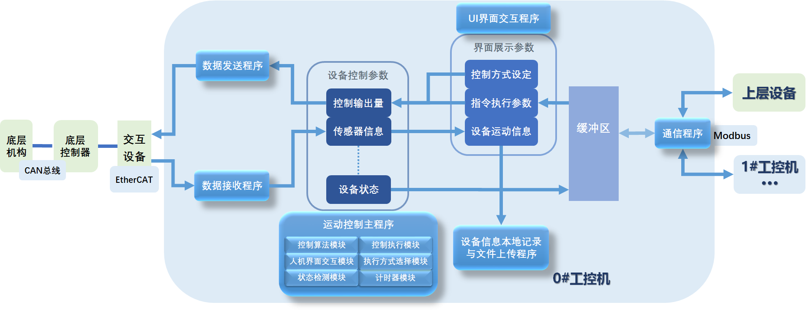

### 某重型物料运输系统项目介绍2

本项目开发使用CODESYS 集成开发环境 V3.5 SP10版本，结构化文本ST语言进行开发。图片不可见时可查看仓库Barrier.pdf文件

#### 1.程序结构

程序建立多个实时任务并行工作：

1. `CAN_RX`和`CAN_TX`任务通过映射关系与硬件建立连接
2. `MAIN`时运功控制的主程序，在接收到动作指令后根据设备状态和控制方式等参数进行运动控制
3. `VisuElems.Visu_Prg`是界面可视化任务，负责相关数据展示和发送控制指令
4. `EtherCAT_Master.EtherCAT_Task`任务负责EtherCAT主从站的信息交互
5. `modebusAct`任务用于通信，一方面做客户端与华中数控连接，不断向其发送当前状态并实时接收其动作指令，另一方面做服务器与其他工控机通讯。

#### 2.设备结构

设备结构如上图所示。中层浅色部分设备是本项目的硬件结构

受控设备与控制器通讯：山河智能控制器通过PWM信号输出控制液压系统的电磁阀操作设备运动，受控设备的传感器通过CAN总线向控制器发送位移传感器数据

SWMC的上层是EtherCAT的从站，由EL6751和 EK1100组成。其中EL6751端子模块通过CAN与底层SWMC进行信息通信，实现位移传感器数据的接收和指令下发；EK1100一端连接EL6751子模块，另一端提供Ether CAT的通信连接，实现CAN/EtherCAT通信协议的互转，为上层搭建好Ether CAT接口的从站。

工控机通过EtherCAT连接各从站，通过软件编程实现数据运算和控制，通过ModbusTCP协议向华中数控提供接口。

