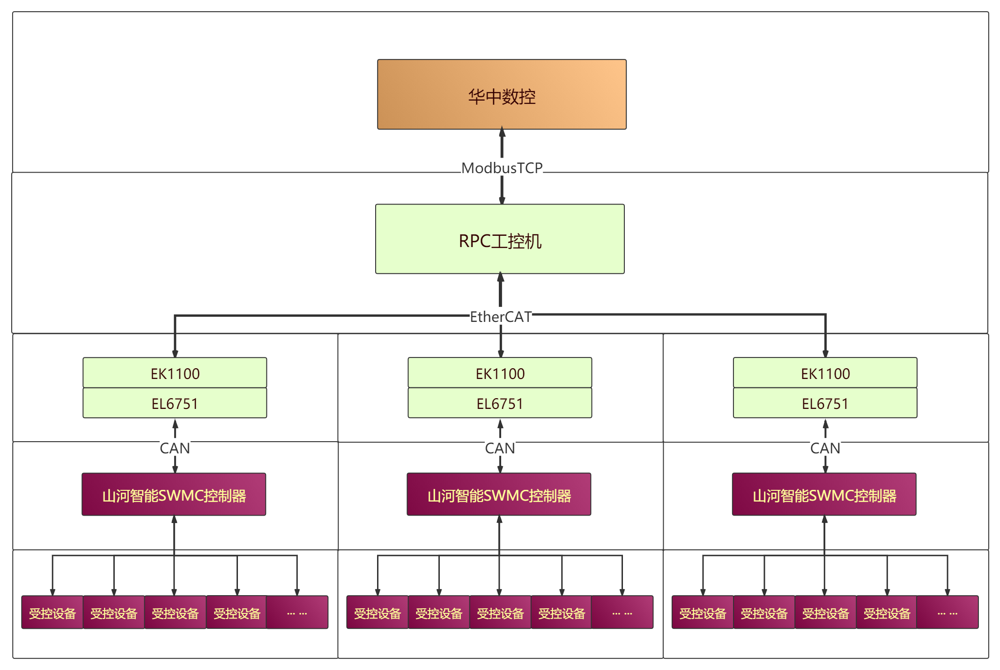
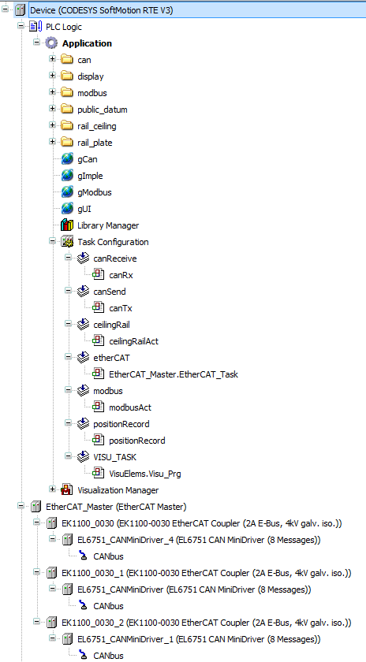
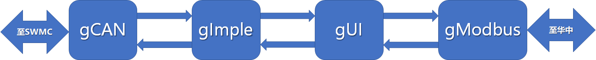
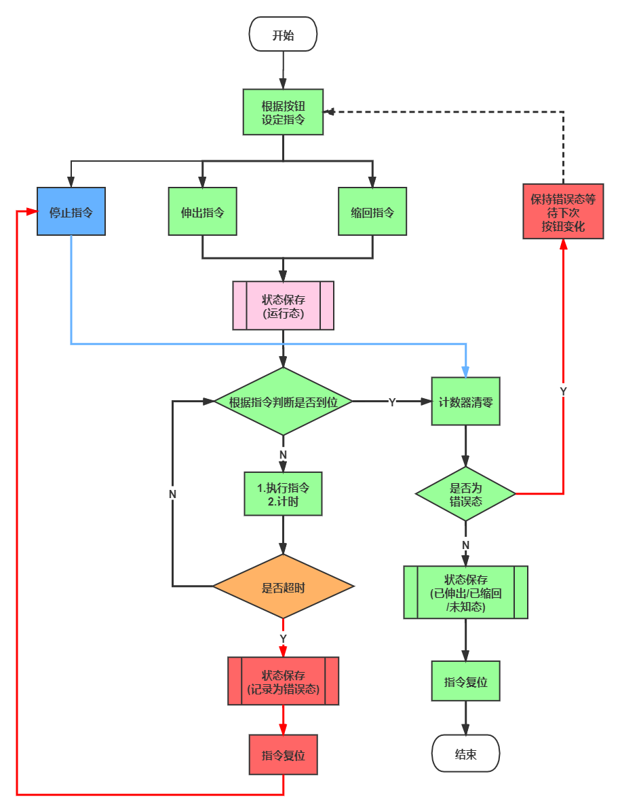

### 某重型物料运输系统项目介绍

本项目开发使用CODESYS 集成开发环境 V3.5 SP10版本，结构化文本ST语言进行开发。图片不可见时可查看仓库skyWell.pdf文件

#### 1.设备结构

设备结构如上图所示。中层浅色部分设备是本项目的硬件结构

受控设备与控制器通讯：山河智能控制器通过PWM信号输出控制液压系统的电磁阀操作设备运动，受控设备的传感器通过CAN总线向控制器发送位移传感器数据

SWMC的上层是EtherCAT的从站，由EL6751和 EK1100组成。其中EL6751端子模块通过CAN与底层SWMC进行信息通信，实现位移传感器数据的接收和指令下发；EK1100一端连接EL6751子模块，另一端提供Ether CAT的通信连接，实现CAN/EtherCAT通信协议的互转，为上层搭建好Ether CAT接口的从站。

工控机通过EtherCAT连接各从站，通过软件编程实现数据运算和控制，通过ModbusTCP协议向华中数控提供接口。

#### 2.程序结构

程序建立多个实时任务并行工作：

1. canRx和canTx任务绑定结构gCAN任务使用不同循环时间与底层设备通讯
2. ceilingRailAct任务绑定结构gImple负责运算处理上下层交互的信号量
3. VisuElems.Visu_Prg任务是系统界面线程绑定结构gUI负责信息显示和信号量输入
4. EtherCAT_Master.EtherCAT_Task任务负责EtherCAT主从站的信息交互
5. modebusAct任务绑定结构gModbus与华中数控连接

#### 3.局部程序逻辑

